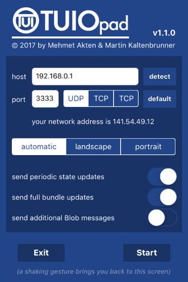

TuioPad is an open source TUIO tracker for iOS devices such as the iPad, iPhone and iPod touch, which allows multi-touch remote 
control based on the [TUIO protocol](http://www.tuio.org/). This application is available free of charge on the App Store and can 
be used in conjunction with any TUIO enabled client application. Its source code is also available under the terms of the GPL and 
therefore can be freely used for the creation of open source TUIO enabled mobile applications. Apart from that the TuioPad is 
also a useful tool for the development and testing of TUIO 1.1 client implementations.

The application binary can be installed directly from the [iTunes App Store](http://itunes.apple.com/us/app/tuiopad/id412446962). 
If you are looking for a TUIO tracker on Android devices please check out 
[TUIOdroid](https://github.com/TobiasSchwirten/tuiodroid) instead.

## Features and Configuration
TuioPad implements the TUIO 1.1 Cursor profile and is capable of sending multi-touch events to TUIO clients on other devices via 
a WIFI or 3G network connection. Apart from the standard TUIO/UDP transport via port 3333 this application can also use 
alternative TUIO/TCP connections and alternative ports. The verbosity of the TUIO messages can be configured in order to improve 
the protocol robustness for unreliable network connections. The optional TUIO 1.1 Blob messages additionally encode the touch 
footprint size (unfortunately without rotation), which may be useful in some application scenarios.

The binary provided on the App Store requires iOS 8.0 or later. In order to compile this application you will need a working 
installation of OpenFrameworks 0.98 for iOS.

 

## Acknowledgments
This application is based on [OpenFrameworks](http://www.openframeworks.cc) and has been created by [Mehmet 
Akten](http://www.memo.tv/) and [Martin Kaltenbrunner](http://modin.yuri.at). The included C++ TUIO reference implementation is 
using the [oscpack library](http://www.rossbencina.com/code/oscpack) by [Ross Bencina](http://www.rossbendina.com/). Please note 
that the GPL demands the publication of the full source code of any derived work. If you are planning to develop a proprietary 
application based on this code, we may be able to provide an alternative commercial license option.
